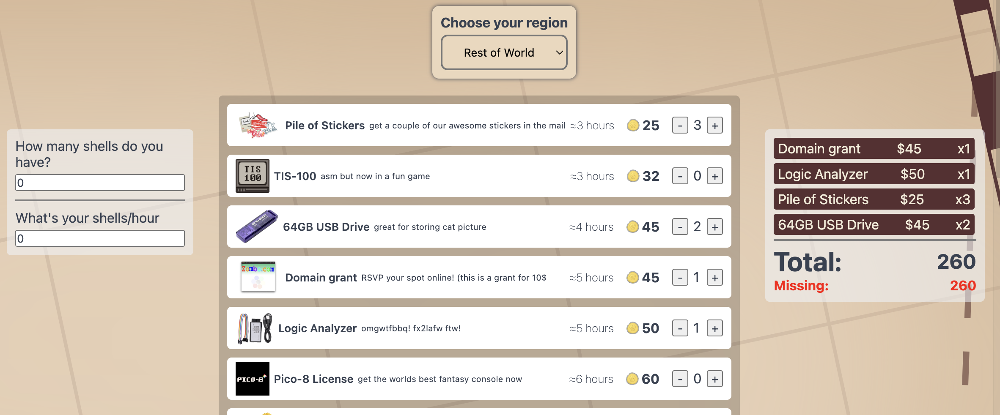
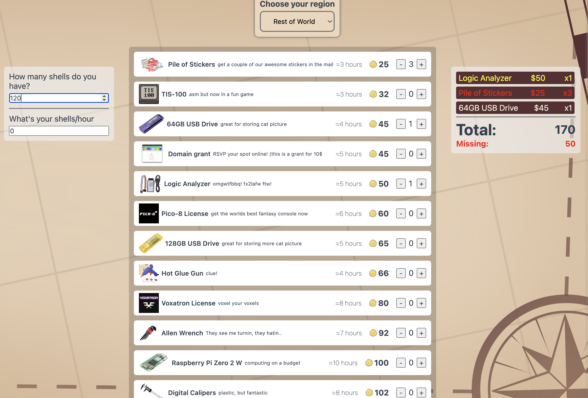

# Summer of Making Shopping Cart
Ever see the shop and wonder, what will buy? How many ~~doubloons~~ shells will I need to buy all i want to buy? How many hours do I need to spend coding to complete my order?  

Well look no further because this app will help you oranize your thoughts and make your plan to order everything.

---

## What are shells
I don't know how you found this project and don't know what shells are. But they're the currency for the hack club ysws program [Summer of Making](https://summer.hackclub.com).

---

## How to use this
Head to [ranadr.me/summerom-shopping-cart/](https://ranadr.me/summerom-shopping-cart/)

Enter your details at the left of the page, if you dont have any just leave it like that.

Use the `+`or `-`at the side of each item to add or remove from your cart.

At the right side you'll see the `ticket` here you can see a summary of all your items.

If you click at an item in the ticket it will get removed from it and th quantity wil be set to 0.

If you filled out the shells/hour you'll see an estimated time coding remaining needed to buy your stuff.

If the item in the ticket is yellow that means that if you remove one of that item you can afford to buy everything, if it is red it means that you can remove more than one you'll be able to afford everything

> DISCLAIMER  
> It currently does not work on phone or screens that are to thin. I probably wont fix this as I am lazy

## Shop data
You are welcome to use the scraped shop data found at [/shop-data/shop.json](./shop-data/shop.json) i will probably update this regularly, in any case you can see when it was created inside of the json.  
If you want to make your own shop.json just run scraper.json (`$ node scraper.json`) and it will generate the file

`Happy Coding`